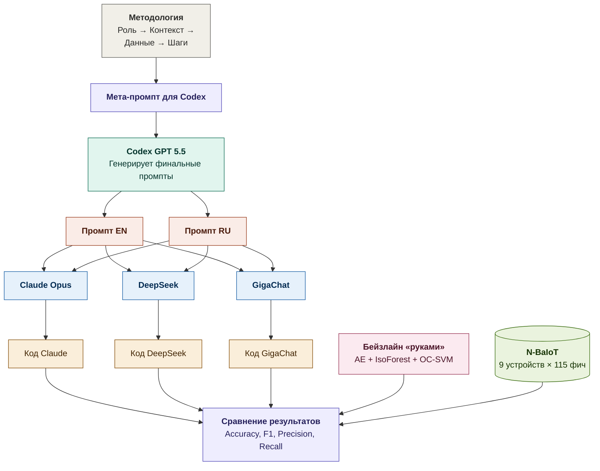
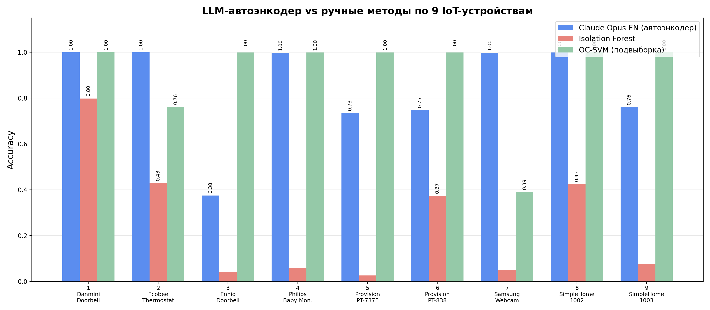

# LLM BotNet Detection
Обнаружение ботнет-атак в IoT-трафике с помощью LLM-генерируемого кода

## Цель и задачи 

**Цель**: исследовать возможность построения рабочей системы (Python-приложения) обнаружения ботнет-атак посредством промптов для LLM.

Основной функционал итоговой системы: автоэнкодер, который обучался на нормальном трафике, способен обнаружить аномальный (вредоносный) трафик в сетях IoT. Если декодировщик ошибка восстановления данных, пришедших на вход кодировщику, превышает порог, то трафик классифицируется как атака.

**Задачи:**
1. Разработать промпт для генерации Python-кода.
2. Получить Python-код через LLM: Claude Opus 4.6, DeepSeek V4, GigaChat.
3. Сравнить результаты на EN и RU промптах.
4. Сопоставить LLM-код с "ручными" моделями (автоэнкодер, Isolation Forest, One-Class SVM).
5. Оценить результаты на всех IoT-устройствах датасета.


## Датасет
 
**N-BaIoT** — реальный сетевой трафик с 9 коммерческих IoT-устройств (камеры, термостаты, дверные звонки), заражённых ботнетами Mirai и BASHLITE. Каждая запись содержит 115 числовых признаков — статистик сетевого потока (ПРИМЕРЫ).
 
- Источник: [Kaggle](https://www.kaggle.com/datasets/mkashifn/nbaiot-dataset) / [UCI ML Repository, ID 442](https://archive.ics.uci.edu/ml/datasets/detection_of_IoT_botnet_attacks_N_BaIoT)
- Оригинальная статья: Meidan et al. (2018) "N-BaIoT — Network-Based Detection of IoT Botnet Attacks Using Deep Autoencoders"
  
| ID | Устройство | Тип |
|---|---|---|
| 1 | Danmini Doorbell | Дверной звонок |
| 2 | Ecobee Thermostat | Термостат |
| 3 | Ennio Doorbell | Дверной звонок |
| 4 | Philips B120N10 Baby Monitor | Видеоняня |
| 5 | Provision PT-737E | Камера безопасности |
| 6 | Provision PT-838 | Камера безопасности |
| 7 | Samsung SNH-1011 Webcam | Веб-камера |
| 8 | SimpleHome XCS7-1002-WHT | Камера безопасности |
| 9 | SimpleHome XCS7-1003-WHT | Камера безопасности |

**Признаки (115 features)**

Каждая запись — это статистики сетевого потока, вычисленные за временные окна (100мс, 500мс, 1.5с, 10с, 1мин):

| Группа | Что измеряет |
|---|---|
| MI (MAC-IP) | Трафик по паре MAC + IP источника |
| H (Host) | Трафик по IP источника |
| HH (Host-Host) | Трафик между парой IP (источник → назначение) |
| HH_jit | Джиттер (вариация задержки) между хостами |
| HpHp | Трафик между парой IP:порт → IP:порт |

Для каждой группы вычисляются: `weight` (кол-во пакетов), `mean` (средний размер), `std` (отклонение), `magnitude`, `radius`, `covariance`, `pcc` (корреляция).

<details>
<summary>Пример одной записи (первые 10 из 115 признаков)</summary>

| MI_dir_L5_weight | MI_dir_L5_mean | MI_dir_L5_variance | MI_dir_L3_weight | MI_dir_L3_mean | ... |
|---|---|---|---|---|---|
| 8.84 | 360 | 21200 | 10.9 | 360 | ... |

</details>

**Разметка (Ground Truth)**

Есть benign-файлы и attck-файлы.
- Все записи из benign-файла `*.benign.csv` -- нормальное поведение. У файла метка **0** (нормальный трафик)
- Все записи из attack-файла `*.gafgyt.*.csv` или `*.mirai.*.csv` -- аномальное поведение. У файла метка **1** (атака)

**Как обнаруживается атака**

Нормальный трафик IoT-устройства _предсказуем_: камера регулярно шлёт видеопоток одинаковыми пакетами, термостат раз в минуту отправляет температуру. Заражение ботнетом резко меняет паттерн:

| Тип атаки | Что происходит с трафиком |
|---|---|
| DDoS (combo, udp, tcp) | Скачок количества пакетов, множество новых адресов назначения |
| Scan | Устройство «стучится» на сотни неизвестных IP |
| Junk | Мусорные пакеты нетипичного размера, mean и std отклоняются |

_Автоэнкодер_ учит «портрет» нормального трафика. Когда приходит атакующий трафик, модель не может его восстановить → ошибка реконструкции взлетает → атака обнаружена.

## Как формировался промпт

Для получения целевых промптов, генерирующих наше Python-приложения, мы предварительно написали промпт для их получения -- мета промпт.
Он был сгенерирован нейтральной (не используемой в дальнейших экспериментах) моделью Codex / GPT 5.5, что исключает предвзятость.

 Файл `meta_propt_for_codex.md`
 

 
На основе методологии из Monge Martinez (2023) ["Using LLMs and GPT to streamline data analysis in cybersecurity incidents"](https://luckyluk3.medium.com/using-llms-and-gpt-to-streamline-data-analysis-in-cybersecurity-incidents-ebeb0d23e01b):
 
| Компонент | Содержание |
|---|---|
| Роль| Генератор Python-кода для кибербезопасности |
| Контекст| Обнаружение аномалий автоэнкодером, подход N-BaIoT |
| Данные | Описание CSV-файлов, 115 признаков, структура именования |
| Шаги | Загрузка → предобработка → модель → порог → оценка → визуализация |


## Выбор LLM
 
| Модель | Происхождение | Почему выбрана |
|---|---|---|
| Claude Opus 4.6 | США (Anthropic) | Лидер по генерации кода (SWE-Bench 80.8%) |
| DeepSeek V4 | Китай (DeepSeek) | Сильная в коде (лучше справляется с EN промптами), бюджетнее Claude |
| GigaChat | Россия (Сбер) | Русскоязычная модель — для проверки RU промпта |
 
Каждая модель получила оба промпта (EN и RU) в отдельных чатах → 6 скриптов.

## Бейзлайн «руками» (???)
 
Для сравнения с LLM-генерированным кодом реализованы два метода вручную:
 
| Метод | Зачем |
|---|---|
| Isolation Forest| Классический метод обнаружения аномалий без нейросетей |
| One-Class SVM | Другой принцип (граница в пространстве признаков) — третья точка сравнения |

## Структура репозитория
 
```
├── README.md
├── meta_prompt_for_codex.md          # Мета-промпт для Codex
├── prompts/
│   ├── prompt_en.md                  # Промпт EN (сгенерирован Codex)
│   └── prompt_ru.md                  # Промпт RU (сгенерирован Codex)
├── generated_code/
│   ├── claude_en.py                  # Claude Opus 4.6 + EN промпт
│   ├── claude_ru.py                  # Claude Opus 4.6 + RU промпт
│   ├── deepseek_en.py                # DeepSeek V4 + EN промпт
│   ├── deepseek_ru.py                # DeepSeek V4 + RU промпт
│   ├── gigachat_en.py                # GigaChat + EN промпт
│   └── gigachat_ru.py                # GigaChat + RU промпт
├── baseline/
│   └── botnet_detection_manual.py    # Ручной бейзлайн (IsoForest + OC-SVM)
├── results/
│   ├── device_1_danmini_doorbell/    # Результаты по устройству 1: llm.txt и manual_baseline.txt
│   ├── device_2_ecobee_thermostat/
│   ├── ...
│   └── device_9_simplehome_1003/
├── run_all.sh                        # Скрипт для прогона всех экспериментов (9 устройств)
├── run_all_manual.sh                 # Прогон бейзлайна × 9 устройств
├── requirements.txt
├── presentation/                     # Слайды (LaTeX)
└── diagram1.png, diagram2.png        # Схемы эксперимента
```

## Как запустить
1. Установка зависимостей
 
```bash
pip3 install -r requirements.txt
```

2. Скачивание датасета
Скачать CSV-файлы с [Kaggle](https://www.kaggle.com/datasets/mkashifn/nbaiot-dataset) и распаковать в папку `dataset/`.
 
3. Запуск одного скрипта (только на устройстве 1 -- пример)
 
```bash
cd generated_code
python3 claude_en.py --data_dir ../dataset --device_id 1 2>&1 | tee ../results/device_1_danmini_doorbell/claude_en.txt
```

4. Запуск всех экспериментов (все 6 скриптов × 9 устройств)
 
```bash
chmod +x run_all.sh
./run_all.sh
```

5. Запуск ручного бейзлайна (Isolation Forest + One-Class SVM) (только на устройстве 1 -- пример)

```bash
python3 baseline/botnet_detection_manual.py --data_dir dataset --device_id 1 2>&1 | tee results/device_1_danmini_doorbell/manual_baseline.txt
```

6. Запуск ручного бейзлайна на всех 9 устройствах

```bash
chmod +x run_all_manual.sh
./run_all_manual.sh
```


## Результаты

### LLM: Device 1 (Danmini Doorbell)

| Модель | Промпт | Accuracy | Precision | Recall | F1 (attack) |
|---|---|---|---|---|---|
| Claude Opus | EN | 0.9997 | 0.9997 | 1.00 | 0.9999 |
| Claude Opus | RU | 0.9998 | 0.9998 | 1.00 | 0.9999 |
| DeepSeek V4 | EN | 0.9999 | 1.00 | 1.00 | 1.00 |
| DeepSeek V4 | RU | 0.9999 | 1.00 | 1.00 | 1.00 |
| GigaChat | EN | 0.9999 | 1.00 | 1.00 | 1.00 |
| GigaChat | RU | 1.00* | 1.00 | 1.00 | 1.00 |

*GigaChat RU показывает Accuracy=1.00 на всех 9 устройствах — возможна утечка данных.

### LLM vs ручные методы (Device 1)

| Метод | Accuracy |
|---|---|
| LLM-автоэнкодер (лучший) | **0.9999** |
| Isolation Forest | 0.7982 |
| One-Class SVM (подвыборка 20k) | 0.9998 |

### Accuracy по 9 устройствам



### Ключевые выводы

1. **LLM-автоэнкодер значительно превосходит Isolation Forest** на всех устройствах
2. **Device 3 (Ennio Doorbell) и Device 9 (SimpleHome 1003)** — проблемные для всех методов (Accuracy ~0.37–0.76)
3. **Claude проседает на devices 5–6** (камеры Provision, Accuracy ~0.73), DeepSeek и GigaChat держат 0.999+
4. **Язык промпта**: минимальное влияние на метрики, но DeepSeek RU содержал 2 бага в коде
5. **GigaChat RU**: подозрительно идеальные результаты (1.00 везде) — вероятна утечка данных

## Предварительные наблюдения

Объём сгенерированного кода:
 
| Модель | EN (строк) | RU (строк) |
|---|---|---|
| Claude Opus 4.6 | 416 | 482 |
| DeepSeek V4 | 387 | 430 |
| GigaChat | 258 | 211 |
 
- Claude — самый подробный код с детальными комментариями и именованными слоями
- DeepSeek — хороший баланс между полнотой и компактностью
- GigaChat — самый лаконичный, но все компоненты на месте

Обнаруженные ошибки:
- `deepseek_ru.py` содержал 2 бага: некорректное чтение CSV (`header=None` вместо автоопределения заголовков) и несуществующая переменная `history` в возврате функции. Скрипты Claude и GigaChat этих проблем не имели.
